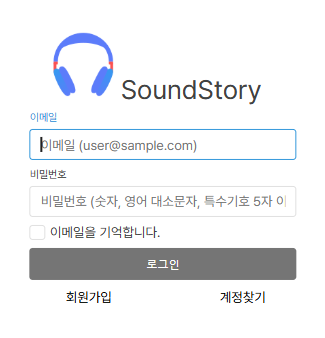

## 음악 스트리밍 서비스 SoundStory 🎶

  

- 배포 URL : https://kshh.kr
- TEST ID : ghktkf789@gmail.com
- TEST PASSWORD : 11111
    

## 🙋‍♀️ 프로젝트 소개   

- SoundStory는 **<u>사용자만의 플레이리스트를 만들고 음악을 스트리밍 할 수 있게</u>** 하기 위해 만들었습니다. 
- <b> 검색을 통해 손쉽게 원하는 음악을 찾아 스트리밍하거나, 좋아하는 곡을 저장</b>할 수 있습니다.
- 노래 혹은 아티스트에 대해 생각을 공유할 수 있는 <b>댓글 기능을 만들어 각 유저들 간의 소통</b>이 이루어 지도록 했습니다.
- 사용자 취향에 맞춰 <b>추천 앨범을 제공</b>하여 새로운 음악을 발견할 수 있게 돕습니다.
- <b> 나만의 플레이리스트를 추가하고 관리</b>하며, 언제든지 원하는 음악을 쉽게 재생할 수 있습니다.

   
  

## 🛠️ 개발 환경

### Front-end
- **HTML**, **SCSS**, **JavaScript**

### Back-end
- **Sprig Boot**, **MyBatis**, **MariaDB**

### 배포 및 클라우드
- **GCP (Google Cloud Platform)**, **Cloudflare**

 

## 💬 페이지별 기능

<b><em>[ 회원가입, 로그인 ]</b></em>

 
- 홈화면에서 로그인을 클릭하면 위와 같은 로그인화면이 표시되어 아래 그림처럼 회원가입을 할 수 있는 폼으로 넘어가진다. 

- 이메일 주소와 비밀번호 등의 유효성검사가 진행되며 검사를 만족하지 못하는 경우 오류 문구가 표시됩니다.
 

 
 
<b><em>[ 노래, 아티스트 검색 ]</b></em>
 

<b><em>[ 댓글 작성 ] </em>
 

<b><em>[ 플레이리스트 ] </em>
 

1. 플레이리스트 노래추가 

 

2. 플레이리스트 중복시

기존 회원중 플레이리스트에 노래가 없다면 상단 경고문으로 예외처리
